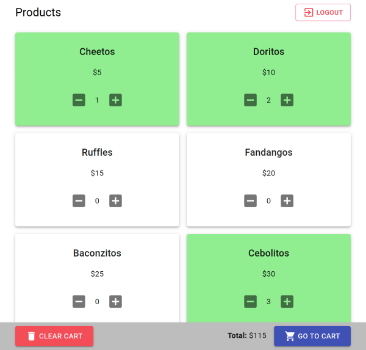

# Pindureta API

REST API of an small vending spot for trustfull users. Users can choose to pay any amount during the purchase or pay later.



> Front-End in [https://github.com/guizoxxv/pindureta-front](https://github.com/guizoxxv/pindureta-front)

## Technology

* Typescript v4.1.2
* NodeJS v15.2.0
* NestJS v7.5.4
* MongoDB 4.4.2

## Installation

1. Install the dependencies
```
npm install
```

2. Copy `.env.example` into as a new file `.env`
```
cp .env.example .env
```

### Configuration

Provide your custom configuration in the `.env` file

* **NODE_ENV:** Application mode
> production, staging, development or testing
* **APP_NAME:** Aplication name
* **APP_VERSION:** Aplication version
* **APP_PORT:** Aplication port
* **APP_LOG_LEVEL:** Aplication log level
* **API_KEY:** API key used to access CRUD functionalities for the `user` and `product` entities.
> Only accessed on development mode.
* **DB_URI:** MongoDB connection URI 
> You can use a MongoDB docker image using the `docker-compose.yml` file.
* **DB_NAME:** Database name
* **JWT_SECRET_KEY:** JWT secret key for JWT token encryption

## Usage

1. To run the application locally:
```
npm run start:dev
```

2. To run the application in production:

    2.1. Build the application
    ```
    npm run build
    ```

    2.2. Deploy the generate `dist` folder.

## Documentation

The API endpoints can be accessed at `/api` on development mode. The documentation was build using [Swagger](https://swagger.io/).

